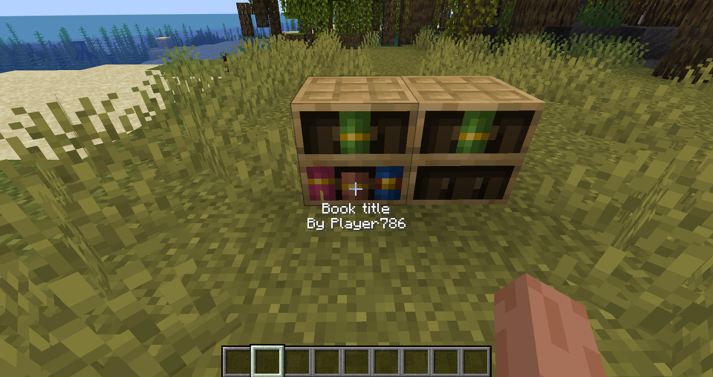
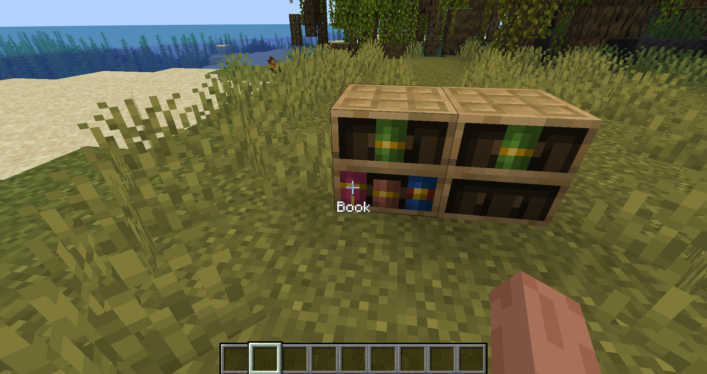
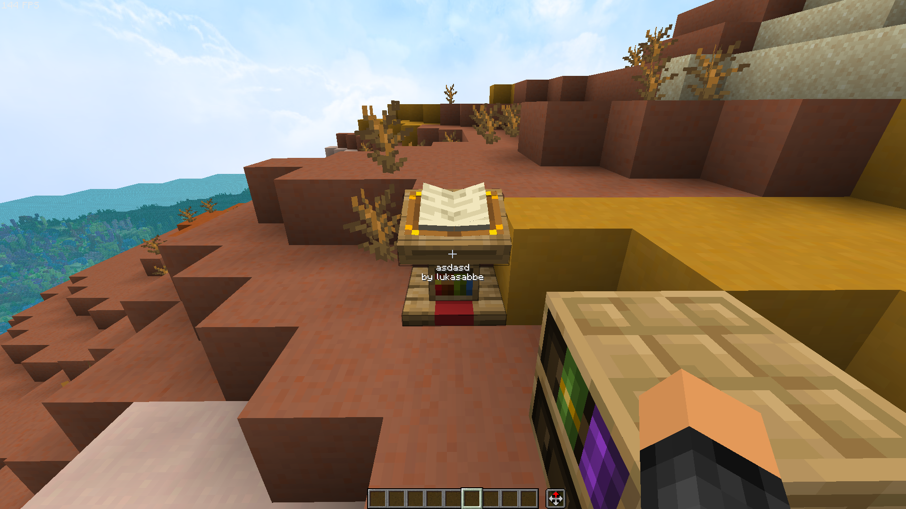
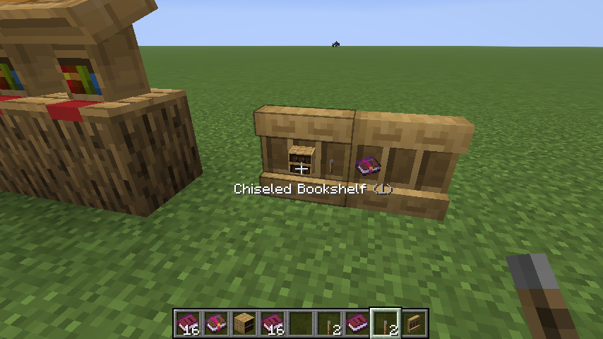

# Chiseled bookshelf inspector

Inspect any book in a chiseled bookshelf.
If you look at a book in a bookshelf with this mod, you will see what type of book it is and its name!

### Examples:

Enchanted books:

Written book:

Normal book:

lectern:

Shelf:

# Multiplayer

This mod will need to be on the server to work in multiplayer.
You don't need the mod to connect to the server. It's totally optional!

# Looking for a server?
Get BisectHosting and save 25% off for new customers using code Lukas at checkout.
Thanks for your support — it helps me develop this and other mods I make!
#ad

# Open source
Nearly all my mods are opensource and under MIT.
Feel free to use however you want.
If you want to help the development, check out the [GitHub](https://github.com/lukasabbe/bookshelf-inspector)!

# Inspiration and credit
- The mod is inspired by [gm4-bookshelf-inspector](https://modrinth.com/datapack/gm4-bookshelf-inspector)
- Lukasabbe has coded
- Wikiraze requested it